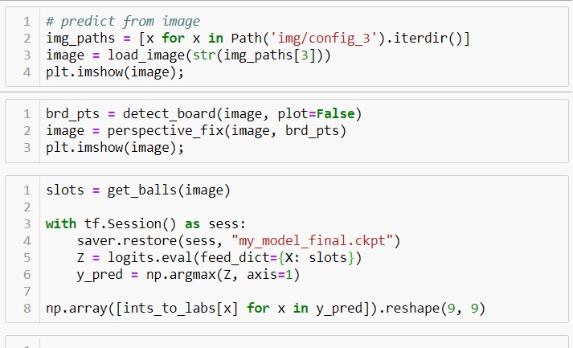

# Sudoku Computer Vision Solver

A deep neural network trained from scratch. > 99% accurate in various lighting conditions.



## Setup

1. Clone this repository (fork it first if you want to deploy to Heroku):
    ```
    git clone https://github.com/chrisluedtke/sudoku-cv.git
    ```
2. Within project repository, create a virtual environment:
    ```
    python -m venv venv
    ```
3. Activate the environment:
    
    Windows:
    ```
    venv\Scripts\activate
    ```
4. Install requirements:
    ```
    pip install -r requirements-opencv.txt
    ```
    or
    ```
    pip install -r requirements-pi.txt
    ```
5. Create a `.env` with contents:
    ```
    FLASK_APP=app:APP
    FLASK_ENV=development
    CAMERA=opencv
    ```
6. Run the web app (the database will be initialized automatically):
    ```
    flask run
    ```
7. Navigate to the locally served page, typically `http://localhost:5000/`
